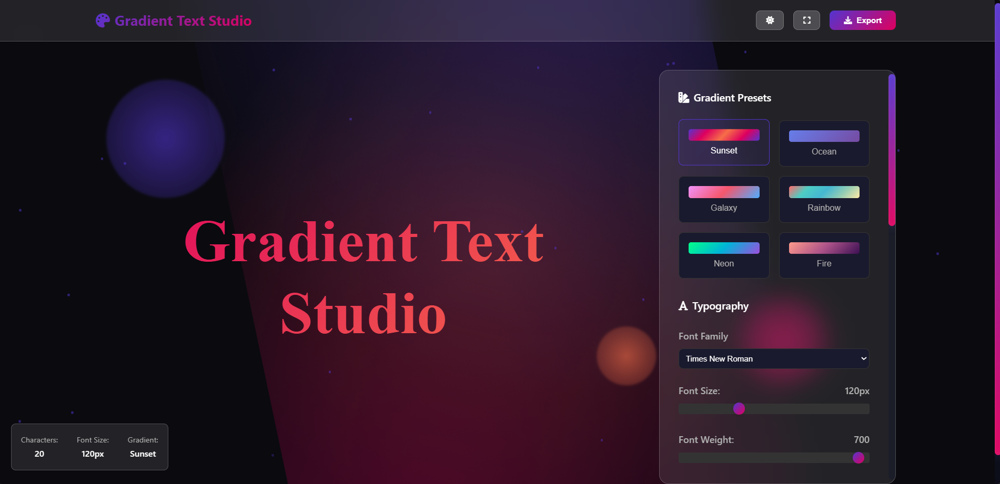

# 🎨 Gradient Text Studio


> An interactive web-based tool for creating and customizing beautiful gradient text effects with real-time preview and export capabilities.

**⚠️ Note:** This is a **practice project** built to explore CSS gradient techniques, DOM manipulation, and UI/UX design patterns.

---

## ✨ Features

- 🎨 **Real-time Gradient Customization** - Adjust colors, angles, and animation
- 🔄 **Live Preview** - See changes instantly as you edit
- 💾 **Multiple Export Options** - Export as CSS, HTML, or Image
- 🌓 **Dark/Light Theme** - Toggle between dark and light modes
- 📱 **Responsive Design** - Works on desktop, tablet, and mobile
- ⚡ **Performance Optimized** - Smooth 60fps animations
- 🎭 **Background Effects** - Dynamic particle system and mesh gradients

---

## 🚀 Demo

🔗 **[Live Demo](https://mehdi-dev-sudo.github.io/Gradient-Text-Studio/)** *(Update with your actual link)*

### Screenshots


---

## 🛠️ Technologies Used

- **HTML5** - Semantic markup
- **CSS3** - Custom properties, animations, glassmorphism
- **Vanilla JavaScript** - No frameworks, pure DOM manipulation
- **Canvas API** - For image export functionality
- **Font Awesome** - Icon library

---

## 📦 Installation & Usage

### Clone the repository
```bash
git clone https://github.com/Mehdi-dev-sudo/gradient-text-studio.git
cd gradient-text-studio
```

### Run locally
Simply open `index.html` in your browser. No build process required!

# Using Python
python -m http.server 8000

# Using Node.js
npx http-server

Then navigate to `http://localhost:8000`

---

## 🎯 What I Learned

This practice project helped me explore:

- ✅ **CSS Gradient Techniques** - Linear/radial gradients, background-clip
- ✅ **Animation Performance** - Using CSS transforms and GPU acceleration
- ✅ **DOM Manipulation** - Dynamic element creation and event handling
- ✅ **Canvas API** - Rendering text to canvas for export
- ✅ **UI/UX Patterns** - Modal dialogs, color pickers, real-time updates
- ✅ **Glassmorphism Design** - Modern frosted glass effect styling

---

## 🎨 Code Highlights

### Gradient Animation System
```javascript
function updateGradient() {
const colors = gradientStops.map(stop =>
`${stop.color} ${stop.position}%`
).join(', ');

gradientText.style.background =
`linear-gradient(${angle}deg, ${colors})`;
gradientText.style.backgroundSize = '400% 400%';
}
```

### Dynamic Particle System
```javascript
class Particle {
constructor(x, y) {
this.x = x;
this.y = y;
this.size = Math.random() * 3 + 1;
this.speedX = Math.random() * 2 - 1;
this.speedY = Math.random() * 2 - 1;
}
// ... animation logic
}
```
---

## 📂 Project Structure

```bash
gradient-text-studio/
├── index.html          # Main HTML file
├── style.css           # All styles
├── script.js           # JavaScript logic
├── screenshot        # Demo images
└── README.md          # This file
```

---

## 🔮 Future Improvements

If I continue developing this project:

- [ ] Add preset gradient templates
- [ ] Implement gradient history/undo feature
- [ ] Add more export formats (SVG, React component)
- [ ] Create a gradient library/gallery
- [ ] Add text effects (shadow, stroke, 3D)
- [ ] Implement keyboard shortcuts

---

## 🤝 Contributing

This is a learning project, but suggestions and feedback are welcome! Feel free to:

1. Fork the repository
2. Create a feature branch (`git checkout -b feature/improvement`)
3. Commit your changes (`git commit -m 'Add some improvement'`)
4. Push to the branch (`git push origin feature/improvement`)
5. Open a Pull Request

---

## 📝 License

This project is open source and available under the [MIT License](LICENSE).

---

## 👨‍💻 About Me

**Mehdi Khorshidi Far**
Junior Frontend Developer | Future Full-Stack & Cybersecurity Engineer

- 🌐 Portfolio: [mehdi-dev-sudo](https://github.com/Mehdi-dev-sudo)
- 📧 Email: mehdi.khorshidi9339@gmail.com

**Current Focus:** Master JavaScript & TypeScript, Full Stack Development + Cybersecurity

---

## 🙏 Acknowledgments

- Inspired by modern gradient tools like [CoolHue](https://webkul.github.io/coolhue/)
- Color palette inspiration from [Gradient Hunt](https://gradienthunt.com/)
- Font Awesome for icons

---

## ⚡ Quick Start

Want to create your own gradient text?

1. **Edit the text** - Click and type your custom text
2. **Choose colors** - Add/remove gradient stops
3. **Adjust angle** - Slide to change gradient direction
4. **Enable animation** - Toggle for smooth color transitions
5. **Export** - Save as CSS, HTML, or Image

---

**⭐ If you found this helpful, consider giving it a star!**

---

*Built with ❤️ as a practice project to improve frontend skills*
